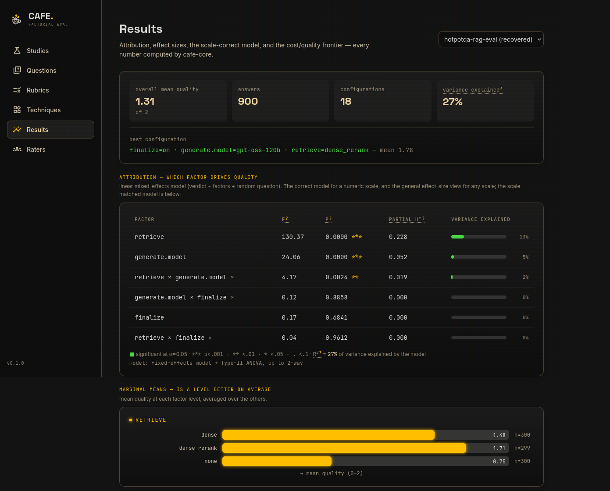
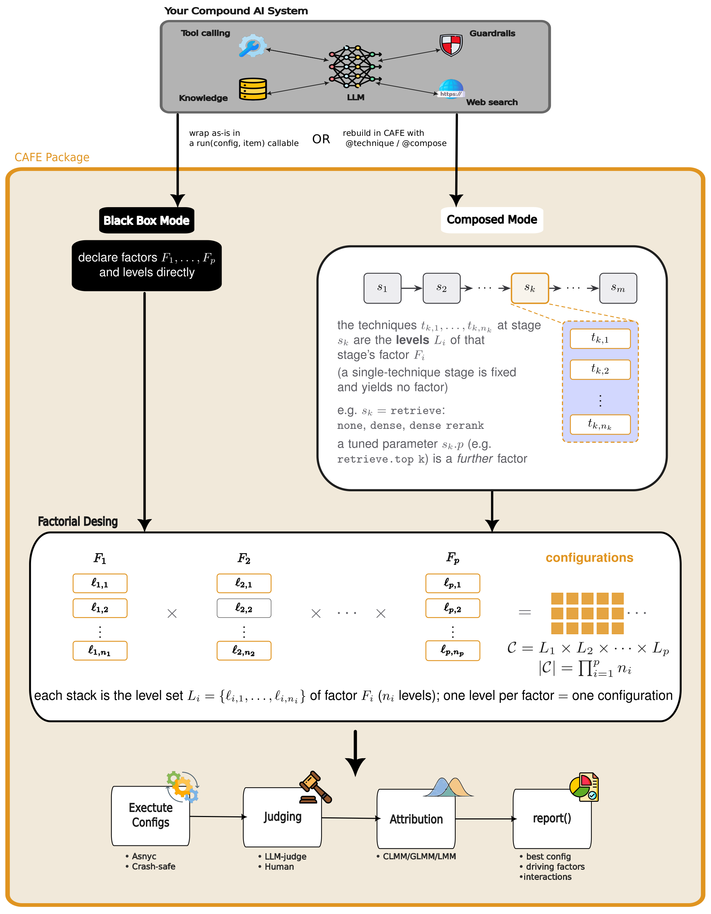

<p align="center">
  
</p>

<h3 align="center">Stop guessing which config is better. Prove it.</h3>

<p align="center">
  A design-of-experiments platform for evaluating <b>compound AI systems</b>.
</p>

<p align="center">
  
  
  <a href="https://fabian-lu.github.io/Cafe"></a>
  <a href="https://arxiv.org/"></a>
</p>

<p align="center">
  <a href="https://cafe-ai.de/demo"><b>Live demo</b></a> &nbsp;·&nbsp;
  <a href="https://fabian-lu.github.io/Cafe">Documentation</a> &nbsp;·&nbsp;
  <a href="#quick-start">Quick start</a> &nbsp;·&nbsp;
  <a href="paper/cafe.pdf">Paper</a>
</p>

---

Modern AI applications are **compound systems**: pipelines of interacting techniques — retrieval,
reranking, context assembly, prompting, one or more model calls, tools, routers, verifiers. When the
output improves, *which part actually helped?* Aggregate benchmarks can't say.

**CAFE treats every pipeline knob as an experimental factor.** It generates factorial designs, runs each
configuration as a black box with replication, collects quality judgments from a configurable LLM judge
(and humans), and attributes the variance in quality with mixed-effects models matched to your rubric's
scale. You get a direct, statistically grounded answer to:

> **which technique drives quality, by how much, what the best configuration is — and whether the
> difference is real** given LLM run-to-run nondeterminism.

CAFE *measures* compound AI systems; it doesn't build them. Bring your system as a black box — a
`run(config, item)` function — or compose it inside CAFE from your own techniques. Either way, CAFE runs
the experiment around it.

<p align="center">
  
</p>

## Why CAFE

- **Attribution, not a leaderboard** — per-factor F-tests, p-values, and partial η² tell you which knob
  moves quality and by how much, holding the others fixed.
- **Statistically honest** — a linear mixed-effects model with a per-question random effect, plus the
  **scale-correct model** for your rubric (ordinal → cumulative-link mixed model, binary → logistic).
- **Built for LLM nondeterminism** — replication and significance testing separate real effects from
  run-to-run noise.
- **Cost / quality trade-offs** — an automatic Pareto frontier over quality vs. cost, latency, tokens.
- **Human + LLM judges** — measure judge↔human agreement with Krippendorff's α (inter-rater reliability).
- **Efficient designs** — full and fractional factorial designs when the configuration space is large.
- **Self-hostable web UI** — the same engine in the browser; no data leaves your machine.

## Quick start

### The library

Requires **Python ≥ 3.11** and **R** — the mixed-effects models (ordinal CLMM, logistic GLMM) run in R.

```bash
git clone https://github.com/fabian-lu/Cafe.git
cd Cafe
pip install -e "packages/cafe-core[stats,llm,notebooks]"

# R + the model packages  (Debian/Ubuntu shown; macOS: `brew install r`)
sudo apt install r-base
Rscript -e 'install.packages(c("ordinal", "lme4"))'

cafe doctor           # verify the environment: Python, R engine, LLM access
cafe run example      # runs a bundled toy study — no API keys needed
```

Or a **complete, runnable example** — no API keys, copy-paste and go. A two-technique QA system
(built with CAFE's decorators) judged by a keyless toy judge:

```python
import cafe, random
random.seed(0)

# A tiny compound system built with CAFE's decorators: one "answer" stage, two techniques.
pipe = cafe.Pipeline()
KNOWN = {"dune": "Frank Herbert", "1984": "George Orwell",
         "the hobbit": "J.R.R. Tolkien", "it": "Stephen King"}

@pipe.technique("answer", "lookup")          # a reliable table
async def lookup(ctx, query):
    return KNOWN.get(query.lower(), "unknown")

@pipe.technique("answer", "guess")           # a noisy baseline
async def guess(ctx, query):
    return random.choice(["Isaac Asimov", "Arthur C. Clarke", "Frank Herbert", "no idea"])

@pipe.compose                                # wire the stages into a runnable system
async def run(config, item, ctx):
    return await ctx.run("answer", query=item["text"])

# A keyless toy judge: score 3 if the reference shows up in the answer, else 0.
class KeywordJudge:
    model = "keyword-match"
    async def score(self, rubric, question, answer, reference=None):
        v = 3 if reference and reference.lower() in str(answer).lower() else 0
        return cafe.JudgeOutput(value=v, value_numeric=v, reasoning="",
                                prompt="", raw_response=str(v))

study = cafe.Study(
    name="toy",
    system=pipe,
    factors=[pipe.factor("answer")],         # levels come from the decorators: lookup, guess
    dataset=[{"text": t, "reference": r} for t, r in {
        "Dune": "Herbert", "1984": "Orwell", "The Hobbit": "Tolkien",
        "It": "King", "Neuromancer": "Gibson", "Foundation": "Asimov",
    }.items()],
    rubric=cafe.rubrics.CORRECTNESS_0_3,
    judge=KeywordJudge(),
    replications=3,
)
print(study.evaluate().report())             # means, significance, effect sizes, CLMM
```
For a real study, swap the technique bodies for model calls (`cafe.complete(...)`) and `KeywordJudge`
for `cafe.LLMJudge(model="ollama_cloud/gpt-oss:20b")`. The [notebooks](examples/) and
[docs](https://fabian-lu.github.io/Cafe) cover systems, custom rubrics/judges, human ratings, and
fractional designs.

### The platform (web app)

A self-hostable FastAPI + React platform over the same engine — set up a study, run it with live
progress, and explore the full analytics in the browser.

```bash
cd apps/web-app
cp .env.example .env      # add your LLM keys
docker compose up
```

Open `http://localhost:5173`. Or just try the [**live demo**](https://cafe-ai.de/demo) (read-only).

## Repository layout

```
packages/cafe-core/   the evaluation engine — the pip-installable library + the `cafe` CLI
apps/web-app/         the self-hostable platform (FastAPI backend + React/Vite frontend)
apps/landing/         the landing page
techniques/           example systems-under-test — the extension point you copy and adapt
examples/             tutorial notebooks (also rendered into the docs)
docs/                 documentation source (MkDocs)
```

## How it works

<p align="center">
  
</p>

1. **Declare factors** — each technique or parameter you compare becomes a factor with levels
   (retrieval ∈ {none, dense, rerank}; model ∈ {small, large}; …).
2. **Generate the design** — CAFE expands the full (or fractional) factorial: every combination to run.
3. **Execute as a black box** — each configuration runs over your dataset with replication; concurrent
   and crash-safe (resumable checkpoints).
4. **Judge** — a configurable LLM judge (and/or humans) scores each answer on your rubric.
5. **Attribute** — scale-matched mixed-effects models give per-factor significance, effect sizes, and
   the best configuration.

Full walkthrough — models, rubrics, judges, human ratings, fractional designs — in the
[documentation](https://fabian-lu.github.io/Cafe).

## Documentation

Full docs — guides, API reference, and runnable tutorials — at
**[fabian-lu.github.io/Cafe](https://fabian-lu.github.io/Cafe)**.

## Citation

If you use CAFE in your research, please cite:

```bibtex
@misc{lukassen2026cafe,
  title         = {{CAFE}: A Compound-AI Factorial Evaluation Framework},
  author        = {Lukassen, Fabian and Weisser, Christoph and Kneib, Thomas and Silbersdorff, Alexander},
  year          = {2026},
  eprint        = {XXXX.XXXXX},
  archivePrefix = {arXiv},
  primaryClass  = {cs.CL}
}
```

## Contributing

Contributions are welcome — see [CONTRIBUTING.md](CONTRIBUTING.md).

## License

[Apache License 2.0](LICENSE).
