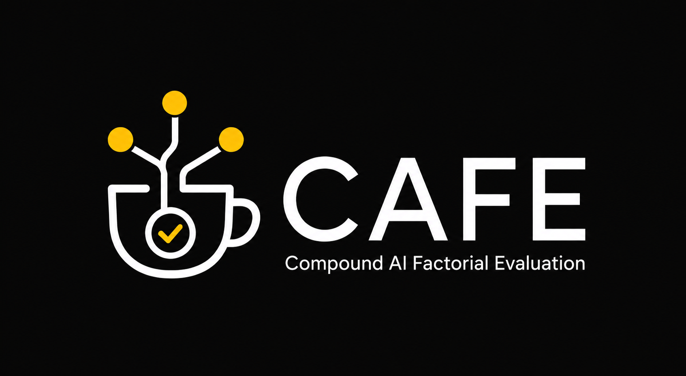

  

# CAFE

**Compound-AI Factorial Evaluation** — a design-of-experiments platform for
evaluating compound AI systems.

> Stop guessing which config is better. Prove it.

Modern AI applications are *compound systems*: pipelines of interacting techniques
— retrieval, reranking, prompting, one or more model calls, tools, routers,
verifiers. CAFE answers what aggregate benchmarks can't:

- **Which technique drives quality**, and by how much?
- **What is the best configuration?**
- **Is the difference real**, or just LLM run-to-run noise?

CAFE treats each pipeline knob as an experimental **factor**, generates factorial
designs, executes configurations with **replication**, collects quality judgments
(LLM judge + humans), and attributes the variance with mixed-effects models matched
to the rubric's scale.

!!! note "CAFE measures; it does not build"
    Bring your system as a **black box** — `run(config, item) -> output` — or compose it
    inside CAFE from your own techniques. Either way CAFE runs the experiment around it,
    which is why it works for *any* compound system: RAG, routing, cascades, agents.

## Where to go next

- **[Quickstart](quickstart.md)** — run your first study in a few lines, no API keys.
- **[Concepts](concepts.md)** — black box, factors, designs, replication.
- **[Define your system](guides/define-a-system.md)** — wire your own system in.
- **[API reference](reference/api.md)** — the `cafe` library, generated from source.

## Status

CAFE is open-source and under active development. The Python library (`cafe-core`),
the LLM judge and mixed-effects statistics layers, and the self-hostable web platform
are all shipped. See the [roadmap](https://cafe-ai.de/roadmap.html) for what is coming
next.
